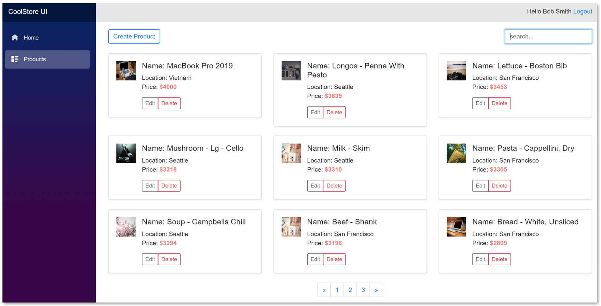

# practical-dapr project

A lightweight low ceremony microservices without Docker, Docker-compose and Helm chart files are lifted and shifted the cloud-native apps to Kubernetes platform and run on Dapr runtime.

[](https://github.com/thangchung/practical-dapr/blob/master/LICENSE)


## Show your support

If you liked `practical-dapr` project or if it helped you, please give a star :star: for this repository. That will not only help strengthen our .NET community but also improve cloud-native apps development skills for .NET developers in around the world. Thank you very much :+1:

# High level architecture


# Communication style


# CoolStore application



# Get starting

## Start required components

- We need Docker for Desktop installed with Kubernetes is enabled.
- Follow those steps at https://github.com/dapr/cli to install Dapr CLI.
- Follow these steps at https://github.com/dotnet/tye/blob/master/docs/getting_started.md to install `tye` CLI.

## One tye command to rule them all

```bash
$ tye run
```

Then you can see `tye dashboard` as below


## Testing it

- Go to `webui`, and on `Bindings` column click to `http` link (http://localhost:58275 in the picture) to access to `Blazor Web UI`
- Go to `identity-api`, and on `Bindings` column click to `http` link (http://localhost:58269 in the picture) to access to `Identity Server 4`
- Go to `graph-api`, and on `Bindings` column click to `http` link (http://localhost:58267 in the picture) to access to `GraphQL Api Server`

### GraphQL server playground

On the `graph-api` link above, you will be redirected to GraphQL Playground, and you can play with it as following:

```js
query {
    products(
    page: 1
    pageSize: 5
    where: { price_lte: 10000 }
    order_by: { price: DESC }
  ) {
    edges {
      id
      name
      imageUrl
      price
      categoryId
      categoryName
      inventoryId
      inventoryLocation
    }
    totalCount
  }
}
```


### Mutation

```js
mutation createProductMutation($createProductInput: CreateProductInput!) {
  createProduct(createProductInput: $createProductInput) {
    product {
      id
      name
    }
  }
}
```

```js
{
  "createProductInput": {
    "name": "product 1",
    "description": "this is a description",
    "imageUrl": "https://picsum.photos/1200/900?image=100",
    "price": 100,
    "categoryId": "77666AA8-682C-4047-B075-04839281630A",
    "inventoryId": "90C9479E-A11C-4D6D-AAAA-0405B6C0EFCD"
  }
}
```


## Debugging application

Follow steps at [Debugging Dapr application using Tye tool](https://dev.to/thangchung/debugging-dapr-application-using-tye-tool-1djb)

## Setup azure cloud services

- [Publish docker image to ACR and AKS](https://docs.microsoft.com/en-us/azure/dev-spaces/how-to/github-actions) and [example](https://github.com/Azure/dev-spaces/blob/master/.github/workflows/bikes.yml)

## Contributing

1. Fork it!
2. Create your feature branch: `git checkout -b my-new-feature`
3. Commit your changes: `git commit -am 'Add some feature'`
4. Push to the branch: `git push origin my-new-feature`
5. Submit a pull request :p